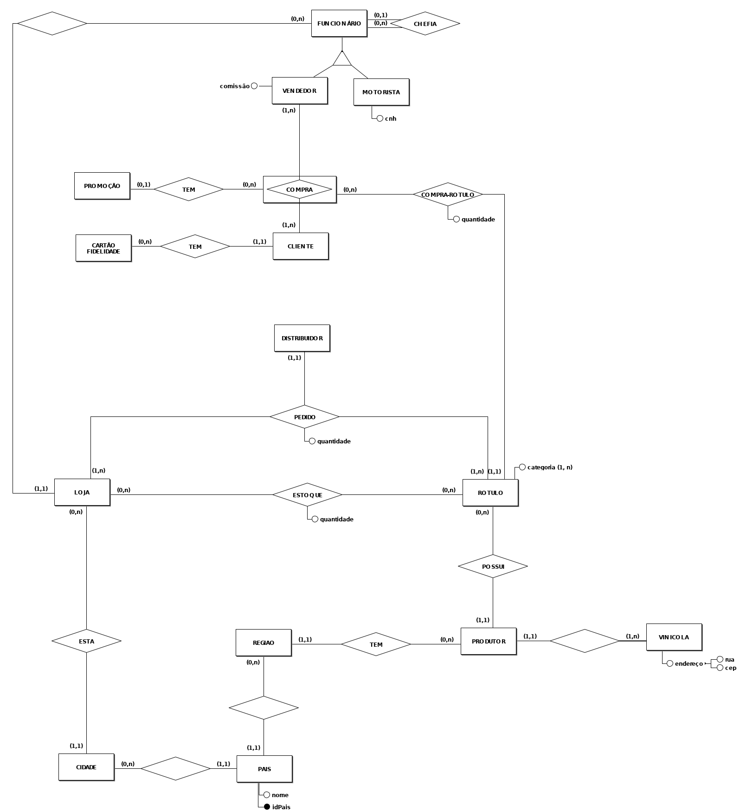

# Projeto de Banco de Dados I - 2019.1


### Grupo

Gabriel Borsero Estrela Bernardo - 20181370004

Patric Lacouth da Silva - 20191370047


## WineStore


#### 1. INTRODUÇÃO


​		Para os propósitos desse trabalho, vamos assumir como nosso minimundo uma rede de lojas de vinhos com várias filiais em cidades diferentes e em diversos países.

​		Uma categoria específica de vinhos pode estar associada a nenhum ou vários rótulos, e um rótulo sempre possuirá uma categoria. Um rótulo sempre será produzido por um produtor, mas um produtor pode produzir vários rótulos. Um produtor está associado a uma vinícola e uma vinícola só pode estar associada a um produtor, de modo que não existe vinícola sem produtor.

​		Vinhos são produzidos em regiões específicas por produtores específicos, logo, registramos a região de cada produtor. Uma região pode possuir nenhum ou vários produtores de vinho, enquanto que cada produtor de vinho deve estar obrigatoriamente vinculado a uma e somente uma região. Por sua vez, cada região estará localizada em somente um país, mas um país pode possuir várias regiões produtoras de vinhos.

​		Cada filial da rede de lojas poderá estar localizada em várias cidades de vários países. Assim, um país estará associado a nenhuma ou várias cidades, mas cada cidade sempre estará associada a um país. Em cada cidade cadastrada teremos nehuma ou várias filiais, mas cada filial obrigatoriamente estará localizada em uma cidade. Cada filial terá em seu estoque nenhum ou vários rótulos, e cada rótulo pode estar em nenhuma ou em várias filiais.

​		A loja realiza seus pedidos de rótulos através de distribuidores específicos. Uma loja pode pedir de um distribuidor um rótulo ou vários. Os distribuidores tem exclusividade na venda de rótulos, de modo que cada loja ao pedir um rótulo, deve fazê-lo a um distribuidor específico.

​		Cada loja de vinhos tem vários funcionários. Cada funcionário pode chefiar vários outros funcionários, cada um deles pode ter apenas um chefe. Funcionários podem ser motoristas (que buscam as entregas nos pontos de distribuição) ou vendedores.

​		Vendedores registram várias compras, e cada compra é registrada por apenas um vendedor. Cada compra tem um cliente associado a ela, mas um cliente pode estar associado a várias compras. Um cliente poderá ser portador de um cartão fidelidade que acumula pontos, cada cartão estará associado a apenas um cliente.

​		Opcionalmente, um evento de compra pode incluir uma, e somente uma, promoção específica (ex.: natal, dia dos namorados, black friday, festa da uva...). Em cada compra teremos um ou vários rótulos, e uma quantidade determinada de um rótulo específico.

#### 

#### 2. ESQUEMA CONCEITUAL



#### 3. ESQUEMA LÓGICO


#### **4. DICIONÁRIO DE DADOS**

##### 4.1 TABELA: ROTULO

| ATRIBUTO             | TIPO         | NULO | DESCRIÇÃO            | DOMÍNIO | PK   | FK   | AK   |
| -------------------- | ------------ | ---- | -------------------- | ------- | ---- | ---- | ---- |
| nome                 | varchar(255) | não  |                      |         |      |      | x    |
| descrição            | text         | sim  |                      |         |      |      |      |
| volume               | decimal(5,2) | não  | volume do vinho      |         |      |      |      |
| ano_producao         | int          | não  | ano de produção      |         |      |      |      |
| percentual_alcoolico | decimal(5,2) | não  | percentual alcoólico |         |      |      |      |
| preco                | decimal(8,2) | não  | preço de venda       |         |      |      |      |
| idrotulo             | int          | não  | código do rótulo     |         | x    |      |      |
| idcategoria          | int          | não  | código da categoria  |         |      | x    |      |
| idprodutor           | int          | não  | código produtor      |         |      | x    |      |

- Constraints:

| COLUNA      | TIPO                                                         | NOME                | EXPRESSÃO                                      |
| ----------- | ------------------------------------------------------------ | ------------------- | ---------------------------------------------- |
| idcategoria | Chave estrangeira referenciando coluna idcategoria da tabela categoria | FK_rotulo_categoria | FOREIGN KEY (idcategoria) REFERENCES categoria |
| idprodutor  | Chave estrangeira referenciando coluna idprodutor da tabela produtor | FK_rotulo_produtor  | FOREIGN KEY (idprodutor) REFERENCES produtor   |
| idrotulo    | Chave primária                                               | PK_rotulo           | PRIMARY KEY (idrotulo)                         |
| nome        | Chave candidata                                              | Ak_rotulo_nome      | UNIQUE(nome)                                   |


##### 4.2 TABELA: Categoria

| ATRIBUTO    | TIPO         | NULO | DESCRIÇÃO           | DOMÍNIO | PK   | FK   | AK   |
| ----------- | ------------ | ---- | ------------------- | ------- | ---- | ---- | ---- |
| nome        | varchar(255) | não  |                     |         |      |      | x    |
| idcategoria | int          | não  | código da categoria |         | x    |      |      |

- Constraint:

| COLUNA      | TIPO            | NOME              | EXPRESSÃO                 |
| ----------- | --------------- | ----------------- | ------------------------- |
| idcategoria | Chave primária  | PK_categoria      | PRIMARY KEY (idcategoria) |
| nome        | Chave candidata | AK_categoria_nome | UNIQUE (nome)             |


##### 4.3 TABELA: Pais

| ATRIBUTO | TIPO         | NULO | DESCRIÇÃO        | DOMÍNIO | PK   | FK   | AK   |
| -------- | ------------ | ---- | ---------------- | ------- | ---- | ---- | ---- |
| nome     | varchar(255) | não  |                  |         |      |      | x    |
| idpais   | int          | não  | código do região |         | x    |      |      |

- Constraints:

| COLUNA | TIPO            | NOME         | EXPRESSÃO            |
| ------ | --------------- | ------------ | -------------------- |
| idpais | Chave primária  | PK_idpais    | PRIMARY KEY (idpais) |
| nome   | Chave candidata | AK_nome_nome | UNIQUE (nome)        |


##### 4.4 TABELA: Região

| ATRIBUTO | TIPO         | NULO | DESCRIÇÃO        | DOMÍNIO | PK   | FK   | AK   |
| -------- | ------------ | ---- | ---------------- | ------- | ---- | ---- | ---- |
| nome     | varchar(255) | não  |                  |         |      |      | x    |
| idregiao | int          | não  | código do região |         | x    |      |      |
| idpais   | int          | não  | código do pais   |         |      | x    |      |

- Constraints:

| COLUNA   | TIPO                                                         | NOME           | EXPRESSÃO                            |
| -------- | ------------------------------------------------------------ | -------------- | ------------------------------------ |
| idregiao | Chave primária                                               | PK_regiao      | PRIMARY KEY (idregiao)               |
| idpais   | Chave estrangeira referenciando coluna idpais da tabela pais | FK_regiao_pais | FOREIGN KEY (idpais) REFERENCES pais |
| nome     | Chave candidata                                              | AK_regiao_nome | UNIQUE (nome)                        |


##### 4.5 TABELA: Produtor

| ATRIBUTO   | TIPO         | NULO | DESCRIÇÃO          | DOMÍNIO | PK   | FK   | AK   |
| ---------- | ------------ | ---- | ------------------ | ------- | ---- | ---- | ---- |
| nome       | varchar(255) | não  |                    |         |      |      | x    |
| telefone   | varchar(255) | não  |                    |         |      |      | x    |
| idprodutor | int          | não  | código do produtor |         | x    |      |      |
| idregiao   | int          | não  | código da região   |         |      | x    |      |

- Constraints:

| COLUNA     | TIPO                                                         | NOME                 | EXPRESSÃO                                |
| ---------- | ------------------------------------------------------------ | -------------------- | ---------------------------------------- |
| idprodutor | Chave primária                                               | PK_produtor          | PRIMARY KEY (idprodutor)                 |
| idregiao   | Chave estrangeira referenciando coluna idregiao da tabela regiao | FK_produtor_regiao   | FOREIGN KEY (idregiao) REFERENCES regiao |
| telefone   | Chave candidata                                              | AK_produtor_telefone | UNIQUE(telefone)                         |
| nome       | Chave candidata                                              | AK_produto_nome      | UNIQUE (nome)                            |


##### 4.6 TABELA: Vinícola

| ATRIBUTO   | TIPO         | NULO | DESCRIÇÃO        | DOMÍNIO | PK   | FK   | AK   |
| ---------- | ------------ | ---- | ---------------- | ------- | ---- | ---- | ---- |
| nome       | varchar(255) | não  |                  |         |      |      | x    |
| rua        | varchar(255) | não  |                  |         |      |      |      |
| bairro     | varchar(255) | não  |                  |         |      |      |      |
| cep        | varchar(255) | não  |                  |         |      |      |      |
| idprodutor | int          | não  | código da região |         | x    | x    |      |

- Constraints:

| COLUNA     | TIPO                                                         | NOME                   | EXPRESSÃO                                    |
| ---------- | ------------------------------------------------------------ | ---------------------- | -------------------------------------------- |
| idprodutor | Chave primária                                               | PK_produtor            | PRIMARY KEY (idprodutor, nome)               |
| idprodutor | Chave estrangeira referenciando coluna idprodutor da tabela produtor | FK_vinicola_idprodutor | FOREIGN KEY (idprodutor) REFERENCES produtor |
| nome       | Chave candidata                                              | AK_vinicola_nome       | UNIQUE (nome)                                |


##### 4.7 TABELA: Cidade

| ATRIBUTO | TIPO         | NULO | DESCRIÇÃO        | DOMÍNIO | PK   | FK   | AK   |
| -------- | ------------ | ---- | ---------------- | ------- | ---- | ---- | ---- |
| nome     | varchar(255) | não  |                  |         |      |      | x    |
| idcidade | int          | não  | código da cidade |         | x    |      |      |
| idpais   | int          | nãoo | código do pais   |         |      | x    |      |

- Constraints:

| COLUNA   | TIPO                                                         | NOME           | EXPRESSÃO                            |
| -------- | ------------------------------------------------------------ | -------------- | ------------------------------------ |
| idcidade | Chave primária                                               | PK_idcidade    | PRIMARY KEY (idcidade)               |
| idpais   | Chave estrangeira referenciando coluna idpais da tabela pais | FK_cidade_pais | FOREIGN KEY (idpais) REFERENCES pais |
| nome     | Chave candidata                                              | AK_cidade_nome | UNIQUE (nome)                        |


##### 4.8 TABELA: Loja

| ATRIBUTO | TIPO         | NULO | DESCRIÇÃO        | DOMÍNIO | PK   | FK   | AK   |
| -------- | ------------ | ---- | ---------------- | ------- | ---- | ---- | ---- |
| nome     | varchar(255) | não  |                  |         |      |      | x    |
| telefone | varchar(45)  | sim  |                  |         |      |      |      |
| email    | varchar(45)  | sim  |                  |         |      |      |      |
| idcidade | int          | não  | código da cidade |         |      | x    |      |
| idloja   | int          | não  | código da loja   |         | x    |      |      |

- Constraints:

| COLUNA   | TIPO                                                         | NOME           | EXPRESSÃO                                |
| -------- | ------------------------------------------------------------ | -------------- | ---------------------------------------- |
| idloja   | Chave primária                                               | PK_idloja      | PRIMARY KEY (idloja)                     |
| idcidade | Chave estrangeira referenciando coluna idcidade da tabela cidade | FK_loja_cidade | FOREIGN KEY (idcidade) REFERENCES cidade |
| me       | Chave candidata                                              | AK_loja_nome   | UNIQUE (nome)                            |


##### 4.9 TABELA: Distribuidor

| ATRIBUTO       | TIPO         | NULO | DESCRIÇÃO              | DOMÍNIO | PK   | FK   | AK   |
| -------------- | ------------ | ---- | ---------------------- | ------- | ---- | ---- | ---- |
| nome           | varchar(255) | não  |                        |         |      |      | x    |
| telefone       | varchar(45)  | sim  |                        |         |      |      | x    |
| iddistribuidor | int          | não  | código de distribuidor |         | x    |      |      |

- Constraints:

| COLUNA   | TIPO            | NOME                     | EXPRESSÃO            |
| -------- | --------------- | ------------------------ | -------------------- |
| idloja   | Chave primária  | PK_idloja                | PRIMARY KEY (idloja) |
| nome     | Chave candidata | AK_distribuidor_nome     | UNIQUE (nome)        |
| telefone | Chave candidata | AK_distribuidor_telefone | UNIQUE (telefone)    |


##### 4.9 TABELA: Pedido

| ATRIBUTO       | TIPO | NULO | DESCRIÇÃO              | DOMÍNIO | PK   | FK   | AK   |
| -------------- | ---- | ---- | ---------------------- | ------- | ---- | ---- | ---- |
| quantidade     | int  | não  |                        |         |      |      |      |
| iddistribuidor | int  | não  | código de distribuidor |         | x    | x    |      |
| idloja         | int  | não  | código da loja         |         | x    | x    |      |
| idrotulo       | int  | não  | código do rótulo       |         | x    | x    |      |
| data           | date | não  | data do pedido         |         | x    |      |      |

- Constraints:

| COLUNA         | TIPO                                                         | NOME                   | EXPRESSÃO                                            |
| -------------- | ------------------------------------------------------------ | ---------------------- | ---------------------------------------------------- |
| -              | Chave primária composta                                      | PK_pedido              | PRIMARY KEY (idepedido)                              |
| iddistribuidor | Chave estrangeira referenciando coluna iddistribuidor da tabela distribuidor | FK_pedido_distribuidor | FOREIGN KEY (iddistribuidor) REFERENCES distribuidor |
| idloja         | Chave estrangeira referenciando coluna idloja da tabela loja | FK_pedido_loja         | FOREIGN KEY (idloja) REFERENCES loja                 |
| idrotulo       | Chave estrangeira referenciando coluna idrotulo da tabela rotulo | FK_pedido_rotulo       | FOREIGN KEY (idrotulo ) REFERENCES rotulo            |
| -              | Chaves candidatas                                            | AK_pedido              | UNIQUE (data, iddistribuidor, idloja, idrotulo)      |


##### 4.10 TABELA: Estoque

| ATRIBUTO   | TIPO | NULO | DESCRIÇÃO        | DOMÍNIO | PK   | FK   | AK   |
| ---------- | ---- | ---- | ---------------- | ------- | ---- | ---- | ---- |
| quantidade | int  | não  |                  |         |      |      |      |
| idloja     | int  | não  | código da cidade |         |      | x    |      |
| idrotulo   | int  | não  | código do pais   |         |      | x    |      |

- Constraints:

| COLUNA     | TIPO                                                         | NOME                 | EXPRESSÃO                                |
| ---------- | ------------------------------------------------------------ | -------------------- | ---------------------------------------- |
| -          | Chave primária composta                                      | PK_lojarotulo        | PRIMARY KEY (idcidade, idloja)           |
| idrotulo   | Chave estrangeira referenciando coluna idrotulo da tabela rotulo | FK_lojarotulo_rotulo | FOREIGN KEY (idrotulo) REFERENCES rotulo |
| idloja     | Chave estrangeira referenciando coluna idloja da tabela loja | FK_lojarotulo_loja   | FOREIGN KEY (idloja) REFERENCES loja     |
| quantidade | Quantidade deve ser maior ou igual a 0                       | CK_quantidade        | CHECK (quantidade >= 0)                  |


##### 4.11 TABELA: Funcionario

| ATRIBUTO      | TIPO         | NULO | DESCRIÇÃO             | DOMÍNIO                    | PK   | FK   | AK   |
| ------------- | ------------ | ---- | --------------------- | -------------------------- | ---- | ---- | ---- |
| nome          | varchar(255) | não  |                       |                            |      |      | x    |
| telefone      | varchar(45)  | não  |                       |                            |      |      | x    |
| email         | varchar(45)  | não  |                       |                            |      |      |      |
| ativo         | tinyint      | não  |                       | 0 - Inativo<br />1 - Ativo |      |      |      |
| idloja        | int          | não  | código da loja        |                            |      | x    |      |
| idchefia      | int          | não  | código da chefia      |                            |      | x    |      |
| idfuncionario | int          | não  | código do funcionário |                            | x    |      |      |

- Constraints:

| COLUNA        | TIPO                                                         | NOME                    | EXPRESSÃO                                     |
| ------------- | ------------------------------------------------------------ | ----------------------- | --------------------------------------------- |
| idfuncionario | Chave primária                                               | PK_funcionario          | PRIMARY KEY (idfuncionario)                   |
| idchefia      | Chave estrangeira referenciando coluna idchefia da tabela chefia | FK_funcionario_chefia   | FOREIGN KEY (idchefia) REFERENCES funcionario |
| idloja        | Chave estrangeira referenciando coluna idloja da tabela loja | FK_funcionario_loja     | FOREIGN KEY (idloja) REFERENCES loja          |
| nome          | Chave candidata                                              | AK_funcionario_nome     | UNIQUE (nome)                                 |
| telefone      | Chave candidata                                              | AK_funcionario_telefone | UNIQUE (telefone)                             |
| ativo         | Validação do domínio.<br/>Caracteres permitidos: 0, 1        | CK_funcionario_ativo    | CHECK ( sexo IN (0, 1 ))                      |


##### 4.12 TABELA: Vendedor

| ATRIBUTO      | TIPO          | NULO | DESCRIÇÃO             | DOMÍNIO | PK   | FK   | AK   |
| ------------- | ------------- | ---- | --------------------- | ------- | ---- | ---- | ---- |
| comissão      | decimal (2,2) | não  |                       |         |      |      |      |
| idfuncionario | int           | não  | código do funcionário |         |      | x    |      |

- Constraints:

| COLUNA        | TIPO                                                         | NOME                    | EXPRESSÃO                                          |
| ------------- | ------------------------------------------------------------ | ----------------------- | -------------------------------------------------- |
| idfuncionario | Chave estrangeira referenciando coluna idfuncionario da tabela funcionario | FK_vendedor_funcionario | FOREIGN KEY (idfuncionario) REFERENCES funcionario |
| idfuncionario | Chave primária                                               | Pk_funcionário          | PRIMARY KEY (idfuncionario)                        |


##### 4.13 TABELA: Motorista

| ATRIBUTO      | TIPO        | NULO | DESCRIÇÃO             | DOMÍNIO | PK   | FK   | AK   |
| ------------- | ----------- | ---- | --------------------- | ------- | ---- | ---- | ---- |
| cnh           | varchar(45) | não  |                       |         |      |      |      |
| idfuncionario | int         | não  | código do funcionário |         |      | x    |      |

- Constraints:

| COLUNA        | TIPO                                                         | NOME                    | EXPRESSÃO                                          |
| ------------- | ------------------------------------------------------------ | ----------------------- | -------------------------------------------------- |
| idfuncionario | Chave estrangeira referenciando coluna idfuncionario da tabela funcionario | FK_vendedor_funcionario | FOREIGN KEY (idfuncionario) REFERENCES funcionario |
| idfuncionario | Chave primária                                               | Pk_funcionário          | PRIMARY KEY (funcionario)                          |
| cnh           | Retringe o domínio do campo                                  | CK_cnh                  | CHECK (LEN(cnh)=6)                                 |


##### 4.14 TABELA: Promoção

| ATRIBUTO       | TIPO         | NULO | DESCRIÇÃO          | DOMÍNIO | PK   | FK   | AK   |
| -------------- | ------------ | ---- | ------------------ | ------- | ---- | ---- | ---- |
| nome           | varchar(255) | não  |                    |         |      |      |      |
| data_expiracao | date         | não  |                    |         |      |      |      |
| desconto       | decimal(2,2) | não  |                    |         |      |      |      |
| idpromocao     | int          | não  | código da promocao |         | x    |      |      |

- Constraints:

| COLUNA         | TIPO                                                     | NOME        | EXPRESSÃO                          |
| -------------- | -------------------------------------------------------- | ----------- | ---------------------------------- |
| idpromocao     | Chave primária                                           | Pk_promocao | PRIMARY KEY (idpromocao)           |
| data_expiracao | Verifica se a data de expiracao é maior que a data atual | Ck_data_exp | CHECK (data_expiracao > GETDATE()) |


##### 4.15 TABELA: Cliente

| ATRIBUTO  | TIPO         | NULO | DESCRIÇÃO         | DOMÍNIO | PK   | FK   | AK   |
| --------- | ------------ | ---- | ----------------- | ------- | ---- | ---- | ---- |
| nome      | varchar(255) | não  |                   |         |      |      |      |
| telefone  | varchar(45)  | sim  |                   |         |      |      |      |
| email     | varchar(45)  | sim  |                   |         |      |      |      |
| data_nasc | date         | não  |                   |         |      |      |      |
| idcliente | int          | não  | código do cliente |         | x    |      |      |

- Constraints:

| COLUNA    | TIPO                                | NOME         | EXPRESSÃO                                        |
| --------- | ----------------------------------- | ------------ | ------------------------------------------------ |
| idcliente | Chave primária                      | Pk_cliente   | PRIMARY KEY (idcliente)                          |
| data_nasc | Checa se cliente é maior de 18 anos | CK_data_nasc | CHECK((YEAR(GETDATE()) - YEAR(data_nasc)) >= 18) |


##### 4.16 TABELA: Compra

| ATRIBUTO   | TIPO | NULO | DESCRIÇÃO          | DOMÍNIO | PK   | FK   | AK   |
| ---------- | ---- | ---- | ------------------ | ------- | ---- | ---- | ---- |
| idcliente  | int  | não  | código do cliente  |         |      | x    |      |
| idvendedor | int  | não  | código do vendedor |         |      | x    |      |
| idpromocao | int  | sim  | código da promoção |         |      | x    |      |
| data       | date | não  | data da compra     |         |      |      |      |
| idcompra   | int  | não  | código da compra   |         | x    |      |      |

- Constraints:

| COLUNA     | TIPO                                                         | NOME               | EXPRESSÃO                                    |
| ---------- | ------------------------------------------------------------ | ------------------ | -------------------------------------------- |
| idvendedor | Chave estrangeira referenciando coluna idfuncionario da tabela funcionario | Fk_compra_vendedor | FOREIGN KEY (idvendedor) REFERENCES vendedor |
| idcliente  | Chave estrangeira referenciando coluna idcliente da tabela cliente | FK_compra_cliente  | FOREIGN KEY (idcliente) REFERENCES cliente   |
| idpromocao | Chave estrangeira referenciando coluna idpromocao da tabela promocao | FK_compra_promocao | FOREIGN KEY (idpromocao) REFERENCES promocao |
| idcompra   | Chave primária                                               | Pk_compra          | PRIMARY KEY (idcompra)                       |


##### 4.17 TABELA: Compra_Rotulo


| ATRIBUTO   | TIPO | NULO | DESCRIÇÃO         | DOMÍNIO | PK   | FK   | AK   |
| ---------- | ---- | ---- | ----------------- | ------- | ---- | ---- | ---- |
| idcompra   | int  | não  | código do cliente |         | x    | x    |      |
| idrotulo   | int  | não  | código do rotulo  |         | x    | x    |      |
| quantidade | int  | não  |                   |         |      |      |      |

- Constraint:

| COLUNA     | TIPO                                                         | NOME                    | EXPRESSÃO                                |
| ---------- | ------------------------------------------------------------ | ----------------------- | ---------------------------------------- |
| idcompra   | Chave estrangeira referenciando coluna idcompra da tabela compra | FK_compra_compra        | FOREIGN KEY (idcompra) REFERENCES compra |
| idrotulo   | Chave estrangeira referenciando coluna idrotulo da tabela rotulo | FK_compra_rotulo_rotulo | FOREIGN KEY (idrotulo) REFERENCES rotulo |
| -          | Chave primária                                               | Pk_compra_rotulo        | PRIMARY KEY (idcompra, idrotulo)         |
| quantidade | Quantidade deve ser maior ou igual a 0                       | CK_quantidade           | CHECK (quantidade >= 0)                  |


##### 4.18 TABELA: Cartao_Fidelidade

| ATRIBUTO | TIPO | NULO | DESCRIÇÃO        | DOMÍNIO | PK   | FK   | AK   |
| -------- | ---- | ---- | ---------------- | ------- | ---- | ---- | ---- |
| pontos   | int  | não  | DEFAULT 100      |         |      |      |      |
| idcartao | int  | não  | código do cartão |         | x    |      |      |

- Constraints:

| COLUNA   | TIPO           | NOME      | EXPRESSÃO              |
| -------- | -------------- | --------- | ---------------------- |
| idcartao | Chave primária | Pk_cartao | PRIMARY KEY (idcartao) |


#### 5. SCRIPTS 

##### 5.1 Criação de Tabelas

```sql
CREATE DATABASE WineStore
GO
USE WineSTore
GO
/*** Criação da tabela categoria ***/

CREATE TABLE CATEGORIA (
	idCATEGORIA		SMALLINT		NOT NULL,
	nome			VARCHAR(255)	NOT NULL,
	CONSTRAINT PK_categoria			PRIMARY KEY (idCATEGORIA),
	CONSTRAINT AK_categoria_nome	UNIQUE(nome)
)

/*** Criação da tabela  PAIS ***/

CREATE TABLE PAIS(
	idPAIS			SMALLINT		NOT NULL,
	nome			VARCHAR(255)	NOT NULL,
	CONSTRAINT PK_pais				PRIMARY KEY (idPAIS),
	CONSTRAINT AK_pais_nome			UNIQUE(nome)
)

/*** Criação da tabela  REGIAO ***/

CREATE TABLE REGIAO(
	idREGIAO			SMALLINT		NOT NULL,
	nome				VARCHAR(255)	NOT NULL,
	idPAIS				SMALLINT		NOT NULL,
	CONSTRAINT PK_regiao				PRIMARY KEY (idREGIAO),
	CONSTRAINT AK_regiao_nome			UNIQUE(nome),
	CONSTRAINT FK_regiao_pais			FOREIGN KEY (idPAIS) REFERENCES PAIS
)

/*** Criação da tabela  PRODUTOR ***/

CREATE TABLE PRODUTOR(
	idPRODUTOR			SMALLINT		NOT NULL,
	nome				VARCHAR(255)	NOT NULL,
	telefone			VARCHAR(255)	NOT NULL,
	idREGIAO			SMALLINT		NOT NULL,
	CONSTRAINT PK_produtor				PRIMARY KEY (idPRODUTOR),
	CONSTRAINT AK_produtor_nome			UNIQUE(nome),
	CONSTRAINT AK_produtor_telefone		UNIQUE(telefone),
	CONSTRAINT FK_produtor_regiao		FOREIGN KEY(idREGIAO) REFERENCES REGIAO
)

/*** Criação da tabela  ROTULO ***/

CREATE TABLE ROTULO(	
	idROTULO				SMALLINT		NOT NULL,
	nome					VARCHAR(255)	NOT NULL,
	descricao				VARCHAR(255)	NOT NULL,
	percentual_alcoolico	DECIMAL(5,2)	NOT NULL,
	preco					DECIMAL(8,2)	NOT NULL,
	ano_producao			INT				NOT NULL,
	idCATEGORIA				SMALLINT		NOT NULL,
	idPRODUTOR				SMALLINT		NOT NULL,

	CONSTRAINT PK_rotulo				PRIMARY KEY (idROTULO),
	CONSTRAINT AK_rotulo_nome			UNIQUE(nome),
	CONSTRAINT PK_rotulo_categoria		FOREIGN KEY(idCATEGORIA) REFERENCES CATEGORIA,
	CONSTRAINT FK_rotulo_produtor		FOREIGN KEY(idPRODUTOR) REFERENCES PRODUTOR
)

/*** Criação da tabela  VINICOLA ***/

CREATE TABLE VINICOLA(	
	idPRODUTOR				SMALLINT		NOT NULL,
	nome					VARCHAR(255)	NOT NULL,
	rua						VARCHAR(45)		NOT NULL,
	bairro					VARCHAR(45)		NOT NULL,
	cep						VARCHAR(45)		NOT NULL,

	CONSTRAINT PK_vinicola					PRIMARY KEY(idPRODUTOR,nome),
	CONSTRAINT AK_vinicola_nome				UNIQUE(nome),
	CONSTRAINT FK_vinicola_produtor			FOREIGN KEY(idPRODUTOR) REFERENCES PRODUTOR
)

/*** Criação da tabela  CIDADE ***/

CREATE TABLE CIDADE(	
	idCIDADE				SMALLINT		NOT NULL,
	nome					VARCHAR(255)	NOT NULL,
	idPAIS					SMALLINT		NOT NULL,

	CONSTRAINT PK_cidade				PRIMARY KEY(idCIDADE),
	CONSTRAINT AK_cidade_nome			UNIQUE(nome),
	CONSTRAINT FK_cidade_pais			FOREIGN KEY(idPAIS) REFERENCES PAIS
)

/*** Criação da tabela LOJA ***/

CREATE TABLE LOJA(	
	idLOJA					SMALLINT		NOT NULL,
	nome					VARCHAR(255)	NOT NULL,
	telefone				VARCHAR(45)		NULL,
	email					VARCHAR(45)		NULL,
	idCIDADE				SMALLINT		NOT NULL,

	CONSTRAINT PK_loja						PRIMARY KEY(idLOJA),
	CONSTRAINT AK_loja_nome					UNIQUE(nome),
	CONSTRAINT FK_loja_cidade				FOREIGN KEY(idCIDADE) REFERENCES CIDADE
)

/*** Criação da tabela ESTOQUE ***/

CREATE TABLE ESTOQUE(	
	idLOJA					SMALLINT		NOT NULL,
	idROTULO				SMALLINT		NOT NULL,
	quantidade				INT				NOT NULL,

	CONSTRAINT PK_estoque					PRIMARY KEY(idLOJA, idROTULO),
	CONSTRAINT FK_estoque_rotulo			FOREIGN KEY(idROTULO) REFERENCES ROTULO,
	CONSTRAINT FK_estoque_loja				FOREIGN KEY(idLOJA) REFERENCES LOJA,
	CONSTRAINT CK_quantidade				CHECK(quantidade >= 0)
)

/*** Criação da tabela DISTRIBUIDOR ***/

CREATE TABLE DISTRIBUIDOR(	
	idDISTRIBUIDOR			SMALLINT		NOT NULL,
	nome					VARCHAR(255)	NOT NULL,
	telefone				VARCHAR(45)		NULL,

	CONSTRAINT PK_distribuidor				PRIMARY KEY(idDISTRIBUIDOR),
	CONSTRAINT AK_distribuidor_nome			UNIQUE(nome),
	CONSTRAINT AK_distribuidor_telefone		UNIQUE(telefone),
)

/*** Criação da tabela PEDIDO ***/

CREATE TABLE PEDIDO(
	idPEDIDO			SMALLINT			IDENTITY(1,1) NOT NULL,	
	data				DATE				NOT NULL,
	idDISTRIBUIDOR		SMALLINT			NOT NULL,
	idLOJA				SMALLINT			NOT NULL,
	idROTULO			SMALLINT			NOT NULL,
	quantidade			int					NOT NULL,

	CONSTRAINT PK_pedido					PRIMARY KEY(idPEDIDO),
	CONSTRAINT AK_pedido					UNIQUE(data, idLOJA, idROTULO),
	CONSTRAINT FK_pedido_distribuidor		FOREIGN KEY(idDISTRIBUIDOR) REFERENCES DISTRIBUIDOR,
	CONSTRAINT FK_pedido_loja				FOREIGN KEY(idLOJA) REFERENCES LOJA,
	CONSTRAINT FK_pedido_rotulo				FOREIGN KEY(idROTULO) REFERENCES ROTULO,
	CONSTRAINT CK_pedido_quantidade				CHECK(quantidade>0)
)

/*** Criação da tabela FUNCIONARIO ***/

CREATE TABLE FUNCIONARIO(	
	idFUNCIONARIO		SMALLINT			NOT NULL,
	nome				VARCHAR(255)		NOT NULL,
	telefone			VARCHAR(45)			NOT NULL,
	email				VARCHAR(255)		NOT NULL,
	ativo				TINYINT				NOT NULL,
	idLOJA				SMALLINT			NOT NULL,
	idchefia			SMALLINT			NULL,

	CONSTRAINT PK_funcionario				PRIMARY KEY(idFUNCIONARIO),
	CONSTRAINT AK_funcionario_nome			UNIQUE(nome),
	CONSTRAINT AK_funcionario_telefone		UNIQUE(telefone),
	CONSTRAINT FK_funcionario_loja			FOREIGN KEY(idLOJA) REFERENCES LOJA,
	CONSTRAINT FK_funcionario_chefia		FOREIGN KEY(idchefia) REFERENCES FUNCIONARIO
)

/*** Criação da tabela MOTORISTA ***/

CREATE TABLE MOTORISTA(	
	idFUNCIONARIO		SMALLINT			NOT NULL,
	cnh					VARCHAR(45)			NOT NULL,

	CONSTRAINT PK_motorista					PRIMARY KEY(idFUNCIONARIO),
	CONSTRAINT FK_motorista					FOREIGN KEY(idFUNCIONARIO) REFERENCES FUNCIONARIO,
	CONSTRAINT CK_CNH						CHECK(LEN(cnh)=6)
)

/*** Criação da tabela VENDEDOR ***/

CREATE TABLE VENDEDOR(	
	idFUNCIONARIO		SMALLINT		NOT NULL,
	comissao			INT				NOT NULL,

	CONSTRAINT PK_vendedor				PRIMARY KEY(idFUNCIONARIO),
	CONSTRAINT FK_vendedor				FOREIGN KEY(idFUNCIONARIO) REFERENCES FUNCIONARIO,
)

/*** CRIACAÇÃO DA TABELA CARTAO FIDELIDADE ***/

CREATE TABLE CARTAO(
	idCARTAO		SMALLINT		NOT NULL,
	pontos			SMALLINT		DEFAULT 100,
	CONSTRAINT PK_cartao_fidelidade		PRIMARY KEY(idCARTAO),
)

/*** Criação da tabela CLIENTE ***/

CREATE TABLE CLIENTE(	
	idCLIENTE			SMALLINT		NOT NULL,
	nome				VARCHAR(255)	NOT NULL,
	telefone			VARCHAR(45)		NOT NULL,
	email				VARCHAR(255)	NOT NULL,
	data_nasc			DATE			NOT NULL,
	idCARTAO			SMALLINT		NULL,

	CONSTRAINT PK_cliente				PRIMARY KEY(idCLIENTE),
	CONSTRAINT FK_cliente_cartao		FOREIGN KEY(idCARTAO) REFERENCES CARTAO,
	CONSTRAINT CK_data_nasc				CHECK((YEAR(GETDATE()) - YEAR(data_nasc))>=18)
)

/*** Criação da tabela PROMOÇÃO ***/

CREATE TABLE PROMOCAO(	
	idPROMOCAO			SMALLINT		NOT NULL,
	nome				VARCHAR(255)	NOT NULL,
	data_expiracao		DATE			NOT NULL,
	desconto			DECIMAL(2,2)	NOT NULL,

	CONSTRAINT PK_promocao				PRIMARY KEY(idPROMOCAO),
	CONSTRAINT CK_data_exp				CHECK(data_expiracao > GETDATE())
)

/*** Criação da tabela COMPRA ***/

CREATE TABLE COMPRA(	
	idCOMPRA			SMALLINT		NOT NULL,
	idCLIENTE			SMALLINT		NOT NULL,
	idVENDEDOR			SMALLINT		NOT NULL,
	data				DATE			NOT NULL,
	idPROMOCAO			SMALLINT		NOT NULL,

	CONSTRAINT PK_compra				PRIMARY KEY(idCOMPRA),
	CONSTRAINT FK_compra_cliente		FOREIGN KEY(idCLIENTE) REFERENCES CLIENTE,
	CONSTRAINT FK_compra_vendedor		FOREIGN KEY(idVENDEDOR) REFERENCES VENDEDOR,
	CONSTRAINT FK_compra_promocao		FOREIGN KEY(idPROMOCAO)	REFERENCES PROMOCAO,
)

/*** Criação da tabela COMPRA-ROTULO ***/

CREATE TABLE COMPRA_ROTULO(	
	idCOMPRA			SMALLINT		NOT NULL,
	idROTULO			SMALLINT		NOT NULL,
	quantidade			INT				NOT NULL,

	CONSTRAINT PK_compra_rotulo			PRIMARY KEY(idCOMPRA,idROTULO),
	CONSTRAINT FK_compra_compra			FOREIGN KEY(idCOMPRA) REFERENCES COMPRA,
	CONSTRAINT FK_compra_rotulo_rotulo	FOREIGN KEY(idROTULO) REFERENCES ROTULO,
	CONSTRAINT CK_compra_quantidade		CHECK(quantidade>0)
)
```


##### 5.2 Inserção de Dados

```sql
INSERT INTO CATEGORIA VALUES (1, 'Branco')
INSERT INTO CATEGORIA VALUES (2, 'Verde')
INSERT INTO CATEGORIA VALUES (3, 'Tinto')
INSERT INTO CATEGORIA VALUES (4, 'Rosé')
INSERT INTO CATEGORIA VALUES (5, 'Federweisser')

SELECT *
FROM CATEGORIA

INSERT INTO Pais VALUES (1,'Alemanha')
INSERT INTO Pais VALUES (2,'Argentina')
INSERT INTO Pais VALUES (3,'Austrália')
INSERT INTO Pais VALUES (4,'Áustria')
INSERT INTO Pais VALUES (5,'Bélgica')
INSERT INTO Pais VALUES (6,'Brasil')
INSERT INTO Pais VALUES (7,'Canadá')
INSERT INTO Pais VALUES (8,'Chile')
INSERT INTO Pais VALUES (9,'China')
INSERT INTO Pais VALUES (10,'Dinamarca')
INSERT INTO Pais VALUES (11,'Escócia')
INSERT INTO Pais VALUES (12,'Espanha')
INSERT INTO Pais VALUES (13,'Estados Unidos')
INSERT INTO Pais VALUES (14,'Finlândia')
INSERT INTO Pais VALUES (15,'França')
INSERT INTO Pais VALUES (16,'Grécia')
INSERT INTO Pais VALUES (17,'Inglaterra')
INSERT INTO Pais VALUES (18,'Irlanda')
INSERT INTO Pais VALUES (19,'Itália')
INSERT INTO Pais VALUES (20,'México')
INSERT INTO Pais VALUES (21,'Noruega')
INSERT INTO Pais VALUES (22,'Polônia')
INSERT INTO Pais VALUES (23,'Portugal')
INSERT INTO Pais VALUES (24,'Rússia')
INSERT INTO Pais VALUES (25,'Suécia')
INSERT INTO Pais VALUES (26,'Suiça')
INSERT INTO Pais VALUES (27,'Venezuela')

SELECT * FROM PAIS

INSERT INTO REGIAO VALUES (1, 'Banyuls', 1)
INSERT INTO REGIAO VALUES (2, 'Blanquette', 13)
INSERT INTO REGIAO VALUES (3, 'Cabardès', 13)
INSERT INTO REGIAO VALUES (4, 'Collioure', 1)
INSERT INTO REGIAO VALUES (5, 'Corbières', 17)
INSERT INTO REGIAO VALUES (6, 'Roussillon', 17)
INSERT INTO REGIAO VALUES (7, 'Fitou', 8)
INSERT INTO REGIAO VALUES (8, 'Maury', 16)
INSERT INTO REGIAO VALUES (9, 'Minervois', 5)
INSERT INTO REGIAO VALUES (10, 'Rivesaltes', 3)

SELECT * FROM REGIAO

--10
INSERT INTO PRODUTOR([idPRODUTOR],[nome],[telefone],[idREGIAO]) VALUES(1,'Thaddeus Rosario','1-923-176-1492',8),(2,'Bruce Carpenter','1-750-272-6181',9),(3,'Kato Hicks','1-539-891-0964',6),(4,'Gannon Mcclure','1-417-193-5820',8),(5,'Jared Nichols','1-827-399-6137',9),(6,'Lance Ratliff','1-782-515-8647',2),(7,'Len Dillard','1-733-879-3751',5),(8,'Emerson Obrien','1-900-993-9728',6),(9,'Dane Santana','1-522-879-7658',6),(10,'Oren Armstrong','1-624-542-9546',7);

--10
INSERT INTO VINICOLA([idPRODUTOR],[nome],[rua],[bairro],[cep]) VALUES(1,'Dui LLP','P.O. Box 596, 196 Enim, Street','CAM','4446'),(2,'Odio Aliquam Vulputate Consulting','662-7925 Nunc Rd.','Ulster','6700 ZR'),(3,'Senectus Et Incorporated','Ap #436-5210 Risus Road','Jönköpings län','15666'),(4,'Ante Ipsum Inc.','973-2217 Nostra, St.','HB','9684'),(5,'Convallis Associates','793-7254 Eget Rd.','Kujawsko-pomorskie','51102'),(6,'Lacinia At Iaculis PC','P.O. Box 943, 3539 Semper Street','YK','29892'),(7,'Aliquet Proin Incorporated','760 Auctor, Road','C','16577'),(8,'Enim Etiam Gravida Foundation','7928 Est Rd.','ON','51101'),(9,'Id Erat Etiam Corp.','862-2283 Sodales. Street','SP','V8T 8Z3'),(10,'Ultrices Limited','4394 Nec Avenue','VIC','00462');

--20
INSERT INTO CIDADE([idCIDADE],[nome],[idPAIS]) VALUES(1,'Salzwedel',25),(2,'Oliver',21),(3,'Tay',8),(4,'Augsburg',26),(5,'Kurnool',17),(6,'Lathuy',19),(7,'Tuscaloosa',18),(8,'Bavikhove',20),(9,'Bremen',26),(10,'Remagne',11),(11,'Dieppe',23),(12,'Lienz',20),(13,'Langenhagen',4),(14,'Wandre',16),(15,'Saint-Laurent',16),(16,'Secunderabad',27),(17,'Episcopia',1),(18,'Cabrero',18),(19,'Soria',25),(20,'Cariboo Regional District',4);

--20
INSERT INTO LOJA([idLOJA],[nome],[telefone],[email],[idCIDADE]) VALUES(1,'Ferness','1-905-929-1562','nisi@nisl.net',5),(2,'Habergy','1-935-297-1667','viverra.Maecenas.iaculis@Etiam.co.uk',5),(3,'Vilcún','1-411-414-7662','odio@erat.org',20),(4,'Overrepen','1-136-616-8645','Donec.porttitor@ornare.ca',6),(5,'Kolmont','1-389-364-0469','Curabitur.massa@turpisAliquamadipiscing.org',20),(6,'Gore','1-248-453-6849','lacinia@ligulaNullam.org',3),(7,'Stonewall','1-415-165-4369','eu@mauris.net',11),(8,'Belmont','1-641-258-0375','semper.erat.in@orci.com',6),(9,'Minna','1-367-433-1828','In.faucibus.Morbi@condimentumDonec.ca',5),(10,'Birmingham','1-315-257-0631','ante.bibendum.ullamcorper@Inatpede.co.uk',14),(11,'Forges','1-979-870-7857','facilisi.Sed.neque@magnaCras.net',1),(12,'Saint-Prime','1-665-405-8952','Morbi@facilisiSedneque.ca',10),(13,'Uluberia','1-161-758-0019','felis.Nulla.tempor@dictum.edu',20),(14,'Marcedusa','1-742-957-7799','eu.odio.Phasellus@inmagna.com',1),(15,'Braives','1-648-181-5711','mauris.id@nibh.org',20),(16,'Tailles','1-501-570-5162','Suspendisse.non.leo@enimEtiamimperdiet.net',19),(17,'Bastia','1-774-998-2799','blandit.Nam.nulla@liberoatauctor.net',18),(18,'Cartagena','1-315-604-4701','mauris.aliquam.eu@loremluctusut.net',10),(19,'Melazzo','1-249-989-2343','magna@lobortis.ca',13),(20,'Empoli','1-957-445-4815','lacus@ultriciesadipiscing.org',4);

--10

INSERT INTO ROTULO ([idROTULO],[nome],[descricao],[percentual_alcoolico],[preco],[ano_producao],[idPRODUTOR],[idCATEGORIA]) VALUES(1,' Merlot','Lorem ipsum dolor sit amet,','30.49','104.43',1830,8,2),(2,' Hermitage La Chapelle','Lorem ipsum dolor sit','35.65','571.66',1813,1,1),(3,' Merlot bcd','Lorem ipsum','30.85','417.87',1905,6,1),(4,' Syrah','Lorem ipsum dolor','26.10','031.46',1846,3,4),(5,' Chardonnay ','Lorem ipsum dolor sit amet,','21.74','145.84',2000,10,3),(6,' Gewürztraminer','Lorem ipsum dolor sit','31.26','558.07',1952,2,1),(7,' Chapeleta','Lorem ipsum dolor','32.11','125.00',1848,5,1),(8,' Charmander','Lorem ipsum dolor sit amet,','35.13','149.96',1957,7,5),(9,' Geodude','Lorem ipsum dolor sit amet,','30.84','958.21',1826,5,1),(10,' Syscyther','Lorem ipsum','25.77','308.77',1983,2,3);

--10

INSERT INTO LOJA_ROTULO([idLOJA],[idROTULO],[quantidade]) VALUES(6,8,30),(16,1,29),(3,5,7),(7,3,5),(15,2,8),(10,3,6),(18,6,33),(6,6,7),(18,9,30),(5,3,48);

--10
INSERT INTO DISTRIBUIDOR([idDISTRIBUIDOR],[nome],[telefone]) VALUES(1,'Armando','(949) 963-6782'),(2,'Wilma','(745) 401-5875'),(3,'Madeline','(495) 301-8218'),(4,'Harper','(498) 638-0574'),(5,'Hyacinth','(742) 704-3576'),(6,'Kasper','(768) 423-4899'),(7,'Alyssa','(789) 812-0737'),(8,'Kenneth','(498) 891-0163'),(9,'Kevyn','(574) 275-3899'),(10,'Aiko','(797) 176-7147');

--10
INSERT INTO PEDIDO([data],[idDISTRIBUIDOR],[idLOJA],[idROTULO],[quantidade]) VALUES('25/09/19',2,6,5,2),('19/12/18',1,3,3,25),('28/10/18',2,16,1,44),('06/06/20',6,20,4,30),('30/12/19',2,15,9,30),('08/04/20',4,18,2,48),('10/07/20',7,15,9,5),('08/04/20',10,4,1,5),('30/06/20',7,5,3,50),('05/02/20',8,20,7,10);

--20
INSERT INTO FUNCIONARIO([idFUNCIONARIO],[nome],[telefone],[email],[ativo],[idLOJA]) VALUES(1,'Nehru Lindsay','(387) 346-6014','Duis.volutpat.nunc@Maurisblanditenim.co.uk',1,7),(2,'Chase Cannon','(264) 435-8387','nibh.lacinia@orci.com',0,19),(3,'Marah Michael','(256) 126-6107','scelerisque@laciniavitaesodales.com',1,10),(4,'Sigourney Shelton','(763) 976-7053','Aenean@lobortisrisus.co.uk',1,9),(5,'Iola Workman','(103) 907-3870','nec.metus.facilisis@Donec.edu',1,12),(6,'Melodie Boyd','(103) 983-2834','rutrum@iaculisodio.ca',0,7),(7,'Elizabeth Carver','(282) 118-1355','enim@facilisi.edu',0,10),(8,'Cheyenne Crane','(371) 492-9778','eleifend@necquamCurabitur.org',1,10),(9,'Christopher Carver','(928) 988-3020','euismod@iaculis.org',0,13),(10,'Cedric Hoover','(731) 829-7516','dictum@montesnasceturridiculus.com',0,9);
INSERT INTO FUNCIONARIO([idFUNCIONARIO],[nome],[telefone],[email],[ativo],[idLOJA]) VALUES(11,'Abdul Gamble','(203) 900-4419','nec.ante.Maecenas@Etiamimperdietdictum.ca',1,6),(12,'Xander Bradley','(475) 447-7422','Donec.felis.orci@quamquis.edu',0,4),(13,'Ralph Faulkner','(442) 487-7207','elit.dictum@sollicitudina.org',0,2),(14,'Judah Hodges','(652) 688-3220','dapibus.gravida.Aliquam@Donectemporest.co.uk',0,6),(15,'Melissa Mcintosh','(936) 225-1202','semper.et.lacinia@Proinnonmassa.co.uk',1,9),(16,'Beverly Reid','(387) 774-3634','imperdiet@maurissagittis.com',1,6),(17,'Rahim Rosa','(381) 715-1348','vulputate.risus.a@aliquetProin.net',0,13),(18,'Lucian Estes','(485) 795-6106','pede.Cras.vulputate@nonummyut.co.uk',1,3),(19,'Kaseem Hester','(723) 757-5217','Sed.eu@senectusetnetus.org',1,1),(20,'Ifeoma Hooper','(463) 458-4103','odio.tristique@nislelementumpurus.edu',0,11);

--10

INSERT INTO MOTORISTA([idFUNCIONARIO],[cnh]) VALUES(1,'P7V1C9'),(2,'O9R3V6'),(3,'L7L2M3'),(4,'J5Y1S8'),(5,'U3B4T4'),(6,'S8C7K6'),(7,'F7X2S0'),(8,'Q4E6Q5'),(9,'C4O0V0'),(10,'O4N7K2');

--10
INSERT INTO VENDEDOR([idFUNCIONARIO],[comissao]) VALUES(11,10),(12,13),(13,12),(14,12),(15,12),(16,12),(17,11),(18,11),(19,11),(20,10);

--20
INSERT INTO CLIENTE([idCLIENTE],[nome],[telefone],[email],[data_nasc]) VALUES(1,'Prescott Suarez','(700) 535-8201','libero.at@est.edu','31/12/69'),(2,'Hanna Ray','(198) 973-2795','sagittis.Nullam.vitae@idrisusquis.com','31/12/69'),(3,'Angelica Vance','(481) 846-1264','ipsum.Phasellus@ornareplacerat.net','31/12/69'),(4,'Alana Sellers','(614) 761-1639','commodo.hendrerit@dictum.co.uk','31/12/69'),(5,'Jade Callahan','(340) 657-5066','eu@diam.org','31/12/69'),(6,'Glenna Nash','(618) 388-8798','a@interdumenimnon.co.uk','31/12/69'),(7,'Joseph Pate','(518) 431-6778','pretium.et@Pellentesquehabitant.co.uk','31/12/69'),(8,'Sarah Brock','(125) 725-3364','leo.in@inlobortistellus.org','31/12/69'),(9,'Quynn Maldonado','(633) 203-6548','erat.neque.non@vitaediam.ca','31/12/69'),(10,'Cullen Glass','(136) 869-8925','egestas.blandit@vel.com','31/12/69');
INSERT INTO CLIENTE([idCLIENTE],[nome],[telefone],[email],[data_nasc]) VALUES(11,'Shad Becker','(230) 849-1957','leo.Morbi.neque@Aliquamfringilla.org','31/12/69'),(12,'Dane Frederick','(434) 705-3281','Proin@neque.com','31/12/69'),(13,'Macon Hutchinson','(618) 808-2427','Vivamus.euismod@vel.com','31/12/69'),(14,'Samuel Beard','(178) 962-6557','ultricies.adipiscing@Quisque.net','31/12/69'),(15,'Tamekah Taylor','(751) 266-6724','et.ultrices.posuere@odiosagittissemper.org','31/12/69'),(16,'Kasimir Robbins','(305) 296-8487','egestas.hendrerit@arcuVestibulum.ca','31/12/69'),(17,'Mona Cobb','(482) 822-2409','parturient.montes.nascetur@ornarelectus.net','31/12/69'),(18,'Maxine Jacobson','(188) 649-3968','nec@aliquetPhasellus.edu','31/12/69'),(19,'Desirae Elliott','(450) 655-6560','Nulla.facilisi.Sed@eu.org','31/12/69'),(20,'Sebastian Stevenson','(131) 100-0238','cursus.et.magna@sedsemegestas.org','31/12/69');
--10
INSERT INTO VENDEDOR([idFUNCIONARIO],[comissao]) VALUES(11,10),(12,13),(13,12),(14,12),(15,12),(16,12),(17,11),(18,11),(19,11),(20,10);
--10
INSERT INTO PROMOCAO([idPROMOCAO],[nome],[data_expiracao],[desconto]) VALUES(1,'Sed nunc est,','28/06/20','0.07'),(2,'enim mi tempor','09/10/19','0.24'),(3,'Suspendisse sagittis. Nullam','12/12/19','0.08'),(4,'adipiscing. Mauris molestie','16/07/20','0.02'),(5,'pharetra nibh. Aliquam','15/01/20','0.04'),(6,'egestas nunc sed','01/10/19','0.07'),(7,'magna a neque.','04/08/20','0.02'),(8,'vestibulum nec, euismod','28/03/20','0.25'),(9,'magna. Suspendisse tristique','23/01/20','0.12'),(10,'hendrerit. Donec porttitor','05/08/20','0.03');

--40

INSERT INTO COMPRA([idCOMPRA],[idCLIENTE],[idVENDEDOR],[data],[idPROMOCAO]) VALUES(1,15,20,'10/03/19',6),(2,17,19,'20/12/17',9),(3,1,15,'13/06/19',9),(4,3,17,'08/10/16',4),(5,13,15,'02/01/17',4),(6,2,12,'30/01/20',3),(7,13,17,'25/09/15',3),(8,5,19,'04/03/16',2),(9,16,11,'21/08/19',1),(10,1,13,'29/11/18',3);
INSERT INTO COMPRA([idCOMPRA],[idCLIENTE],[idVENDEDOR],[data],[idPROMOCAO]) VALUES(11,7,19,'13/06/20',1),(12,15,16,'08/10/18',1),(13,8,16,'10/05/19',5),(14,17,12,'14/12/18',10),(15,3,16,'10/08/18',2),(16,9,14,'11/08/18',7),(17,4,11,'04/10/18',10),(18,12,14,'08/11/18',10),(19,12,13,'17/09/19',6),(20,15,19,'18/07/16',5);
INSERT INTO COMPRA([idCOMPRA],[idCLIENTE],[idVENDEDOR],[data],[idPROMOCAO]) VALUES(21,15,15,'04/03/20',4),(22,18,20,'20/01/20',9),(23,8,17,'22/03/19',6),(24,5,19,'01/03/16',5),(25,8,17,'29/01/20',3),(26,16,13,'27/04/20',2),(27,7,20,'17/06/17',6),(28,10,18,'19/09/17',8),(29,6,11,'03/04/18',10),(30,16,18,'18/09/16',4);
INSERT INTO COMPRA([idCOMPRA],[idCLIENTE],[idVENDEDOR],[data],[idPROMOCAO]) VALUES(31,15,20,'31/10/17',1),(32,6,20,'13/05/17',10),(33,8,13,'31/07/18',6),(34,9,19,'16/10/19',3),(35,18,17,'24/11/18',2),(36,4,13,'01/07/17',7),(37,7,11,'16/04/19',4),(38,12,17,'21/05/19',8),(39,20,18,'25/03/18',9),(40,9,16,'17/12/18',2);

--40

INSERT INTO COMPRA_ROTULO([idCOMPRA],[idROTULO],[quantidade]) VALUES(1,7,39),(2,7,81),(3,6,159),(4,3,86),(5,7,50),(6,1,197),(7,8,176),(8,7,110),(9,2,170),(10,8,66),(11,2,158),(12,4,20),(13,10,113),(14,5,5),(15,9,31),(16,5,130),(17,6,189),(18,1,136),(19,5,3),(20,1,153),(21,9,199),(22,4,41),(23,2,110),(24,2,124),(25,1,13),(26,3,176),(27,5,17),(28,1,144),(29,3,66),(30,2,64),(31,2,158),(32,4,193),(33,3,26),(34,8,8),(35,6,139),(36,8,170),(37,4,104),(38,1,111),(39,10,110),(40,4,35);

--20
INSERT INTO CARTAO_FIDELIDADE([idCARTAO],[idCLIENTE],[pontos]) VALUES(1,1,104),(2,2,168),(3,3,200),(4,4,172),(5,5,184),(6,6,168),(7,7,121),(8,8,150),(9,9,128),(10,10,106),(11,11,153),(12,12,195),(13,13,150),(14,14,152),(15,15,166),(16,16,136),(17,17,146),(18,18,153),(19,19,165),(20,20,175);
```


##### 5.3 Atualização de Dados

```sql
--Atualização de mais de um campo da tabela FUNCIONARIO
--Incluindo chefia da loja de id 10, exceto para o funcionário que fornece o id
UPDATE FUNCIONARIO
SET idchefia = 3
WHERE idLOJA = 10 AND idFUNCIONARIO <> 3

--Atualização de um campo da tabela ROTULO
--Modificação do nome de um dos vinhos
UPDATE ROTULO
SET nome = ' Chatuba'
WHERE nome = ' Merlot bcd'
```


##### 5.4 Exclusão de Dados

```sql
--Deletando cartões fidelidade de clientes sem compras
DELETE FROM CARTAO_FIDELIDADE
WHERE idCLIENTE IN (SELECT idCLIENTE FROM CLIENTE WHERE idCLIENTE NOT IN (SELECT idCLIENTE FROM COMPRA))


--Deletando o registro de clientes que não tem compras
DELETE FROM CLIENTE	
WHERE idCLIENTE NOT IN (SELECT idCLIENTE FROM COMPRA)
```


##### 5.5 Consultas de Dados

```sql
--IN: Selecionar por nome as lojas em cidades de código 5 ou 20.
SELECT nome 
FROM LOJA 
WHERE idCIDADE IN (5,20)


--NOT IN: Encontre as categorias diferentes de Branco e Rosé
SELECT * 
FROM CATEGORIA
WHERE nome NOT IN ('Branco', 'Rosé')


--BETWEEN: Selecionar os rótulos cujo percentual alcoolico esteja entre 20% e 30%
SELECT nome, percentual_alcoolico 
FROM ROTULO 
WHERE percentual_alcoolico BETWEEN 25 AND 30


--NOT BETWEEN: Selecionar os rótulos que não tem preço entre R$100,00 e R$200,00
SELECT * 
FROM ROTULO
WHERE preco NOT BETWEEN 100 AND 200

--IS NULL: Selecionar os Funcionários que não são chefiados por ninguém filtrado por nome.
SELECT nome
FROM FUNCIONARIO
WHERE idchefia IS NULL


--IS NOT NULL: Selecione os distribuidores que possuem telefone
SELECT * 
FROM DISTRIBUIDOR
WHERE telefone IS NOT NULL


--LIKE: Selecionar os distribuidores que tem o nome iniciado por H.
SELECT * 
FROM DISTRIBUIDOR 
WHERE nome LIKE 'H%'

--NOT LIKE: Selecione os países que não começam com A
SELECT *
FROM PAIS
WHERE nome NOT LIKE '[AÁ]%'


--ORDER BY: Ordenar pelo valor descendente o preço dos rótulos
SELECT * 
FROM ROTULO 
ORDER BY preco DESC


--COUNT: Verifique quantos rótulos estão cadastrados
SELECT COUNT(*) AS [QUANTIDADE DE RÓTULOS]
FROM ROTULO


--SUM: Somar o preço de todos os rótulos com os quais a empresa trabalha. Filtrar por nome e preço.
SELECT SUM(preco) [Soma de Preços] 
FROM ROTULO


--AVG: Verifique a média dos preços dos rótulos
SELECT AVG(preco) AS [MEDIA DE PREÇOS]
FROM ROTULO


--MAX: Encontrar o vinho com o maior percentual alcóolico.
SELECT MAX(percentual_alcoolico) [Maior percentual alcoolico] 
FROM ROTULO


--MIN: Selecione a promoção mais próxima de terminar
SELECT MIN(data_expiracao) [PROMO PROX END]
FROM PROMOCAO


--GROUP BY: Agrupar quantidade de funcionários ativos e inativos
SELECT ativo, COUNT(*) [atividade]
FROM FUNCIONARIO
GROUP BY ativo


--HAVING: Selecione os rótulos com mais de 5 vendas realizadas
SELECT count(*) AS [Quantidade]
FROM COMPRA_ROTULO
GROUP BY idROTULO
HAVING COUNT(*)>=5


--INNER JOIN:  Selecione todos os pedidos com os respectivos nomes dos rótulos
SELECT p.*, r.nome
FROM PEDIDO as [p] INNER JOIN ROTULO as [r]
on p.idROTULO = r.idROTULO


--LEFT JOIN: Exibir nome do rotulo, código da loja e quantidade em estoque. Devem ser exibidos 
SELECT LOJA_ROTULO.quantidade, ROTULO.nome
FROM ROTULO
LEFT JOIN LOJA_ROTULO ON LOJA_ROTULO.idROTULO=ROTULO.idROTULO


--RIGHT JOIN: Selecione todos os pedidos com os nomes dos rótulos incluíndo os rótulos que nunca foram comprados
SELECT p.*, r.nome
FROM PEDIDO as [p] right join ROTULO as [r]
on p.idROTULO = r.idROTULO


--FULL JOIN: Exibir o nome de cidades que tem lojas bem como o de cidades que não tem loja (mas estão cadastradas)
SELECT LOJA.nome, CIDADE.idCIDADE, CIDADE.nome
FROM LOJA
FULL JOIN CIDADE ON LOJA.idCIDADE=CIDADE.idCIDADE
ORDER BY idCIDADE


--SUBCONSULTA: Exibir preço e nome dos rótulos que tem produtores cujo nome começa com a letra L
SELECT  nome, preco
FROM ROTULO
WHERE idPRODUTOR IN (SELECT idPRODUTOR FROM PRODUTOR WHERE nome LIKE 'L%')

```

